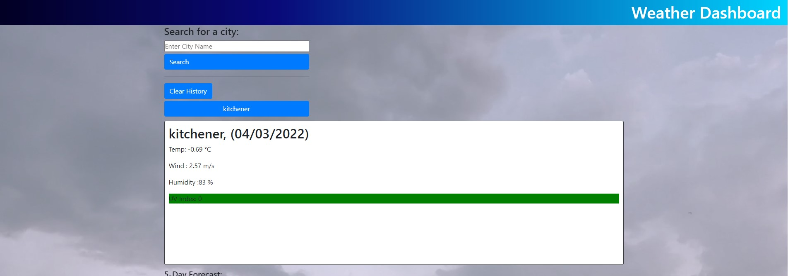
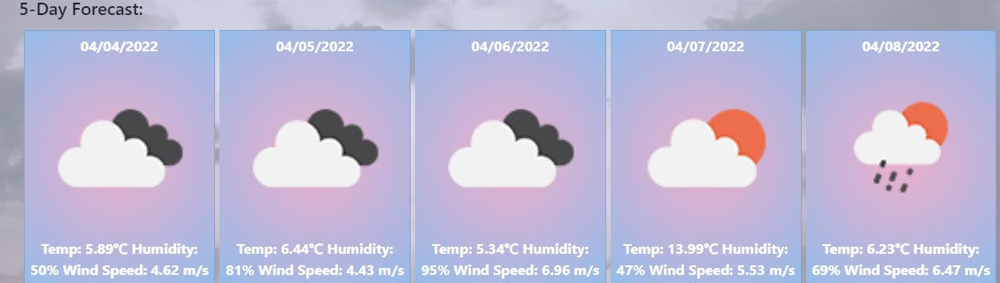
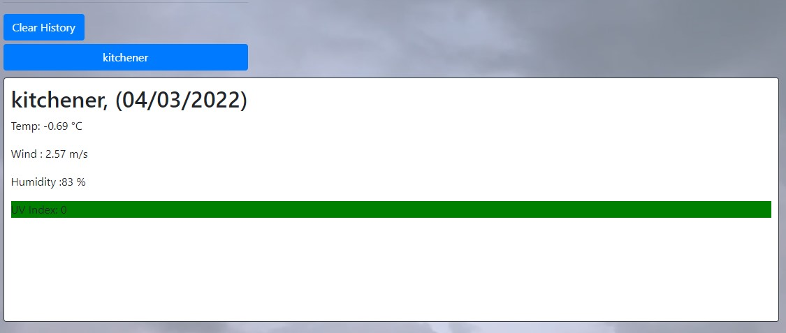

# Weather Application

### Purpose:

* To create a forecast webpage to be able to check the forecast for different places

### Written with:
* HTML
* CSS
* JS
* BOOTSTRAP
* JQUERY
* MOMENT.JS

## Website:
https://nchan22.github.io/weather-application/

## Future Uses:
* Update for more advanced options for inputting text (e.g. time for future weathers or hourly)
* Update to allow user to send suggestion in for different functions and uses

## Screenshots

## Contributors:
Written by Nathaniel Chan
